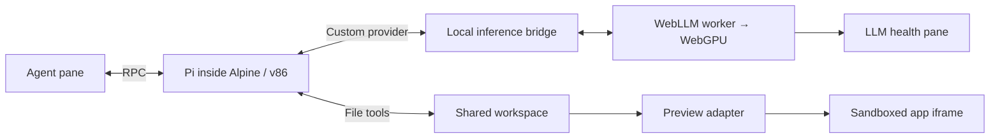

# Fieldwork

A browser-local coding-agent experiment. Pi runs in an emulated Alpine Linux guest, asks a WebGPU model for its next action through a shared-filesystem bridge, and edits a vanilla website shown in a sandboxed preview.

## Run locally

Requires Node 22+, npm, and Docker with `linux/386` support to build the guest. Docker is **not** needed when using the finished website. Use a desktop Chromium browser with WebGPU and hardware acceleration.

```sh
npm ci
npm run assets
npm run guest
npm run dev -- --port 5199 --strictPort
```

Open <http://127.0.0.1:5199>. Click **Start Linux** and **Load model**, then submit a small change when both are ready. The default model is Qwen3.5 4B (4-bit); its weights download on first use and are cached locally. Linux and Pi startup under emulation can take a minute or longer depending on hardware; the boot console exposes the actual Linux shell and diagnostics.

A useful first prompt for the small default model:

> Add a reset button that resets the little joys counter to zero.

The workspace lives in browser OPFS when available. Clearing site data removes it. **Reset project** restores the three starter files and starts a fresh Pi session. Runtime and guest assets are generated locally and ignored by Git.

```sh
npm test
npm run test:guest # Docker transport/tool/cancellation test, fixture inference
npm run build
npm run preview -- --port 5199 --strictPort
```

The `dist/` output can be served statically over HTTPS. The development server is only an asset server, never an inference or agent backend. Vite sends COOP/COEP headers; configure equivalent headers when hosting elsewhere. Hot reload is disabled deliberately: explicitly reload after code changes so a file save does not destroy a running VM or model.

## Architecture



## React shell

Fieldwork uses React with Vite. `index.html` is the entry point; `src/App.tsx` composes the chat, inference, Linux, preview, and console panels in `src/components/`. The generated workspace app remains vanilla HTML/CSS/JavaScript.

`src/fieldwork.ts` creates one session per page. `src/session.ts` owns runtime events, inference requests, commands, and an immutable state snapshot. React subscribes with `useSyncExternalStore`; components never construct the VM or worker. React Strict Mode is enabled. The console stays mounted when hidden, and the iframe document changes only when workspace files change or the user refreshes it, preserving app state during metrics and conversation updates.

## Execution boundaries

- `guest/supervisor.mjs` runs **inside Linux**, embeds the real Pi `Agent` core with Pi's built-in read/write/edit/bash tools, receives UI commands, and writes agent events to `/bridge`. The full Pi CLI remains a research target; the working build uses its smaller SDK path.
- `guest/provider.mjs` is a real Pi custom provider. It writes the model context to `/bridge/request.json` and consumes the corresponding response. Pi validates and executes its normal tools and continues the loop inside Linux.
- `src/runtime.js` boots Wanix, mounts the persistent project, and transports files and events. No shell tools execute on the host machine.
- `src/inference.worker.js` owns the WebLLM engine and GPU inference. Structured JSON selects one Pi tool or a final response. It does not execute tools.
- `src/protocol.js` translates message formats and assembles the preview from actual workspace files.
- The preview iframe runs with `allow-scripts` and without `allow-same-origin`. Its CSP blocks network requests. The initial project supports `index.html`, `style.css`, and `script.js`, not arbitrary assets, npm dependencies, or ES module graphs.

No guest network device is configured. Model downloads are the main external requests after loading the static app. Full offline reload support is not implemented: caching weights alone does not cache every application asset.

## Versions and implementation choices

- Wanix and extras: `0.4.0-rc2`. The npm default tags differ; pin the explicit version.
- Wanix's standard Go WASM build is used. The smaller TinyGo build exhausted its heap while unpacking the Pi filesystem in testing.
- Alpine: 3.22, x86; Node 22; Pi: `@mariozechner/pi-coding-agent@0.73.1`. This established release has a tested provider/RPC interface; upstream has since renamed its packages. The guest dependency graph is locked in `guest/package-lock.json`.
- WebLLM: `0.2.85`. Model: Qwen3.5 4B, 4-bit, 8,192-token context with up to 2,048 output tokens. Earlier validation notes below refer to the original 1.5B prototype.
- Guest memory: 512 MiB, plus Wanix, the root filesystem, model allocations, and browser overhead.
- Current generated rootfs: approximately 36 MiB compressed. This is a working baseline, not a minimal image.

## Current limitations

- Cold boot is still emulated and takes time. The first full-CLI image was 58 MiB and loaded too slowly through 9P. The current build bundles Pi core and its coding tools into a 3.9 MiB JavaScript file, reducing the compressed guest to 36 MiB. Further trimming is possible.
- Model output streams into diagnostics/metrics, but tool actions are buffered until a complete valid JSON object is available. Pi's final text is delivered after generation.
- Each user turn is limited to ten model calls. The provider times out after four minutes per call. Small models can still produce poor edits or fail to follow a task.
- Context is limited to 8K tokens. The model sees the current turn and up to four recent user/final-assistant messages (1,000 characters each); previous tool payloads and failed patch proposals are omitted. Oversized files or long individual turns can still exceed the window. Reset chat starts fresh.
- Stopping aborts the agent and model but does not undo completed writes. The three-file preview refreshes after tool completion; multi-file changes are not transactional.
- Refresh, reset, and export operate on the three supported files. Additional file types and external dependencies are outside this first version.
- The pinned older Pi dependency tree reported eight high-severity npm findings at build time. The guest has no network device; the app dependency audit was clean. Review/upgrade the agent dependency tree before public distribution.

## Validation

- Production frontend build and 29 protocol/preview/session/runtime tests pass, including subscription lifecycles, inference routing, cancellation, and worker failure recovery.
- Pi version and RPC startup verified in a network-disabled 32-bit Docker container.
- Deterministic bridge smoke test: Pi executed its real `edit` tool, changed an HTML title, received the tool result, and completed its turn. The inference response in this isolated test was a fixture, not a model-quality test.
- React migration browser check: model load, Linux boot, OPFS restoration, console toggling, and a real read/edit turn passed. The preview counter survived unrelated UI updates; the final edit appeared as revision 2. No browser errors or warnings were observed.
- Real browser end-to-end test: Qwen2.5-Coder 1.5B running on WebGPU selected Pi's `read` and `edit` tools inside v86. The heading changed to “A little more wonder.” in the live preview. After a page reload and Linux restart, the edited heading was restored from OPFS.
- Observed GPU decode speed was approximately 43–47 tokens/second on this machine; this is a single-session observation, not a benchmark.
- Short prompts can still elicit a false claim of an edit, even after reading the file. Each turn requires an initial inspection; the UI reports when no app files changed. Explicit tool-directed prompts worked in the browser test. Broader coding-task reliability and larger model options remain unvalidated.
- The deterministic guest test also verified tool continuation and cancellation. Unit tests cover malformed actions, transcript translation, and preview escaping. These tests do not measure model quality.

## Attribution

Built on [Wanix](https://github.com/tractordev/wanix), [v86](https://github.com/copy/v86), [Pi](https://github.com/badlogic/pi-mono), and [MLC WebLLM](https://github.com/mlc-ai/web-llm). The [Codex in Wanix](https://github.com/loopwork/wanix-codex) project informed the shared-filesystem architecture and Go runtime choice. Third-party packages and Linux components retain their respective licenses.

### Conversation reset

**Reset chat** clears the displayed conversation and resets Pi’s context after the guest acknowledges the command. It keeps app files and the loaded model. Reset is disabled while the agent is working; stop the current turn first. Rebuild the guest with `npm run guest` after updating from a version without reset acknowledgements.

## Shared React components

Each component in `src/design-system` imports its own adjacent CSS file. Import components directly from their JSX files; shared color and typography tokens load once in `src/main.tsx`; app layout lives in `src/App.css`, and each panel imports its own adjacent CSS file. `src/style.css` contains global defaults and shared pane-heading/runtime-status styles. Runtime state/actions stay in the panels.

| Component         | API                                                                                                                                                                                                                                                  |
| ----------------- | ---------------------------------------------------------------------------------------------------------------------------------------------------------------------------------------------------------------------------------------------------- |
| `Button`          | Native button props, `variant` (`secondary`, `primary`, `ghost`), `size="small"` for compact actions, `iconOnly` for square icon controls, and `destructive`. Defaults to `type="button"`; icon-only buttons need an accessible label.               |
| `StatusIndicator` | `value={{ text, kind }}`; `kind` is empty (idle), `ready`, `busy`, or `error`. Text accompanies the colored dot.                                                                                                                                     |
| `ChatBox`         | Controlled `value`, `onChange`, `onSend`, `canSend`; optional `hint`, `suggestions` (label/text pairs), `showStop`/`onStop`, `label`, `placeholder`, and `maxLength`. Owns keyboard handling and focus, while its parent owns the draft and session. |
| `Wordmark`        | Fieldwork aide branding with optional `href` and accessible `label`.                                                                                                                                                                                 |
| `EmptyState`      | `title` and supporting copy as children, with `headingLevel` (2 or 3) for document structure. Shared typography and alignment; containing panels own width, padding, and placement.                                                                  |

```jsx
import { Button } from "./design-system/Button.tsx";
import { StatusIndicator } from "./design-system/StatusIndicator.tsx";

<Button variant="primary" onClick={loadModel}>Load model</Button>
<StatusIndicator value={{ text: "Ready", kind: "ready" }} />
```

Button classes follow `ds-button` (base), `ds-button--{variant}`, `ds-button--{size}`, and optional `ds-button--icon-only` / `ds-button--destructive`. Size controls geometry and typography; variants control appearance.

## Agent reliability research

The default is Qwen3.5 4B after the October 2026 reset-button trials. The agent still uses Pi's normal `read`, `edit`, `write`, and `bash` tools; existing files are edited with targeted replacements. The suggested reset prompt was not expanded or given a canned implementation.

The bridge previously delivered error text but discarded Pi's successful-edit diffs. It now includes those diffs, supplies fresh file contents after known atomic edit failures, and omits failed patch proposals from subsequent model context. Each turn inspects the three small app files before making changes. Previous tool payloads are dropped between turns; recent user/final-assistant dialogue remains. Qwen's non-thinking mode is explicit and its empty `<think>` prefix is handled before JSON parsing. Truncated responses are rejected before tool execution.

Observed results in one local browser session, using the same reset prompt and starter files:

| Configuration                          | Observed outcome                                                                                        |
| -------------------------------------- | ------------------------------------------------------------------------------------------------------- |
| Original Qwen3 4B                      | 0/2: stopped after HTML, leaving Reset unconnected.                                                     |
| Qwen3 4B with stronger edit protocol   | Still failed: duplicate button or invalid JavaScript, depending on inference mode.                      |
| Qwen2.5-Coder 3B with current protocol | 0/1: edited HTML only; clicking Reset left the count at two.                                            |
| Qwen3.5 4B with current protocol       | 3/3: two normal edit calls, zero tool errors, five browser checks passed; about 27–29 seconds per task. |

A separate warm-palette regression passed with one CSS edit and zero tool errors; HTML and JavaScript remained byte-for-byte unchanged, and Save still incremented. The Qwen3.5 styling follow-up recovered from one exact-match failure and preserved counter behavior and unrelated CSS. It did **not** implement the requested side-by-side placement, so this was a partial success. Whole-file writes were also investigated and rejected: they could implement the counter but risked overwriting unrelated styling. These are exploratory results, not a general reliability guarantee. WebLLM's catalog estimates roughly 3.9 GB GPU memory for Qwen3.5 4B at its default 4K context, versus 3.4 GB for Qwen3 4B; our 8K setting adds context overhead. Model-card references: [Qwen3.5 4B](https://huggingface.co/Qwen/Qwen3.5-4B), [Qwen2.5-Coder 3B](https://huggingface.co/Qwen/Qwen2.5-Coder-3B-Instruct).

## Color system

`src/design-system/tokens/colors.css` is the source of truth for Fieldwork's colors, imported by `src/main.tsx`. Use semantic CSS variables in component styles rather than literal colors. Existing colors are preserved; this is an extraction, not a new theme.

| Role              | Tokens                                                                                                                         |
| ----------------- | ------------------------------------------------------------------------------------------------------------------------------ |
| Surfaces          | `--color-bg-canvas`, `--color-bg-surface`, `--color-bg-hover`, `--color-bg-preview`, `--color-bg-frame`, `--color-bg-terminal` |
| Text              | `--color-text`, `--color-text-muted`, `--color-text-placeholder`, `--color-text-on-accent`                                     |
| Borders           | `--color-border`, `--color-border-strong`                                                                                      |
| Actions           | `--color-accent`, `--color-accent-hover`, `--color-focus`, `--color-focus-halo`                                                |
| Status            | `--color-status-idle`, `--color-status-ready`, `--color-status-busy`                                                           |
| Destructive/error | `--color-danger`, `--color-danger-surface`, `--color-danger-border`, `--color-danger-hover`                                    |
| Shadows           | `--color-shadow-frame`, `--color-shadow-overlay`                                                                               |

For example, use `color: var(--color-text-muted)` for supporting copy and `border: 1px solid var(--color-border)` for dividers. Ready indicators and focus alias the accent; translucent variants derive from their base tokens using relative OKLCH colors so they stay in sync. Shadow geometry stays in component CSS. `transparent`, `inherit`, and `currentColor` remain valid structural values. In forced-color mode, focus uses the system `Highlight` color. The browser theme-color in `index.html` is a deliberate static duplicate for simplicity.

The editable starter app is a separate document with its own palette; these tokens do not leak into it or override Wanix's terminal internals.

## Typography system

`src/design-system/tokens/typography.css` is the source of truth for shell typography. It is imported alongside the color tokens in `src/main.tsx`. The existing sizes and fine weight differences are preserved rather than normalized into a new scale.

- `--font-family-sans` for interface copy; `--font-family-mono` for technical output.
- `--font-size-*` for micro, caption, meta, control, body, body-large, heading, icons, metrics, and branding. Existing display sizes remain available for retained styles.
- `--font-weight-*` for light, regular, medium, emphasis, semibold, heading, and brand.
- `--line-height-*` for solid, display, compact, body, intro, message, and the fixed-height status row.
- `--letter-spacing-*` for normal, tight, brand, brand-suffix, and small uppercase labels.
- `--font-numeric-data` for stable-width changing numbers.

Example:

```css
.panel-heading {
  font-family: var(--font-family-sans);
  font-size: var(--font-size-body-large);
  font-weight: var(--font-weight-heading);
}
```

Use longhand properties when you want to retain inherited weight and leading. Existing `font` shorthands still reset those properties, matching their original behavior. `font: inherit` and `font-synthesis: none` remain structural declarations, not tokens. The starter app and Wanix terminal retain their own typography.

### Theme preference

The title-bar Theme control offers System (the default), Light, and Dark. The selection is saved locally when browser storage is available. System follows OS appearance changes live; the initial theme is resolved in the document head before first paint. Both palettes live in `src/design-system/tokens/colors.css`. The editable preview app retains its own theme.

## Formatting and linting

- `npm run format` formats authored source, styles, markup, and documentation with Oxfmt.
- `npm run format:check` checks formatting without writing files.
- `npm run lint` runs Oxlint and fails on any finding.
- `npm run lint:fix` applies safe lint fixes; remaining findings need review.
- `npm run check` runs formatting checks, lint, unit tests, and the production build.

[Oxfmt](https://oxc.rs/docs/guide/usage/formatter/config.html) uses an 80-column layout, two-space indentation, double quotes, and semicolons. Oxfmt alphabetizes imports within groups (Node built-ins, packages, internal modules, parent modules, and sibling modules), separated by blank lines. Side-effect imports, including CSS, stay in their original positions to preserve initialization and cascade order. Oxlint enforces a blank line after the import block. Generated assets, dependencies, caches, and lockfiles are excluded from formatting.

[Oxlint](https://oxc.rs/docs/guide/usage/linter/config) enables correctness and suspicious checks across JavaScript, React/hooks, accessibility, imports, Unicorn, and Oxc rules, plus explicit equality, const, no-var, and mandatory-brace rules. Browser, worker, and Node environments are configured separately. Exceptions accommodate automatic JSX, CSS side-effect imports, intentional event-handler properties, and valid ARIA status/log roles. Worker messaging is exempt from the window-only target-origin rule. Documented inline exceptions preserve intentional chat-scroll and preview-refresh dependencies.

## TypeScript

The React shell, design-system components, and session controller use strict TypeScript. Vite serves `.ts` and `.tsx` directly during development; `npm run dev` requires no preceding compilation. `npm run typecheck` runs `tsc --noEmit` for validation only, and is included in `npm run check`. The production build remains Vite's existing build.

The inference worker, Wanix runtime adapter, protocol/GPU/starter helpers shared with standalone scripts, guest code, and Node scripts/tests remain JavaScript. Shared session and bridge contracts live in `src/types.ts`; the Wanix adapter exposes its event types through JSDoc. JavaScript modules are allowed at that boundary without enabling whole-project JS type checking. Tests import the TypeScript session directly using Node's native type stripping (Node 22.18+ or a newer supported release).

## Workspace file editors

The preview bar includes Preview, index.html, script.js, and style.css tabs. Start Linux to access the real workspace files. CodeMirror is loaded on demand when a file editor is opened, with HTML/CSS/JavaScript highlighting, line numbers, undo, and search. Editor colors use the Fieldwork theme tokens and update immediately with System/Light/Dark mode.

Edits remain drafts until **Save** (or Cmd/Ctrl+S). Saving writes through Wanix to the shared project and refreshes Preview; switching tabs preserves the live preview and each editor's draft and undo history. Drafts are not persisted across page reloads. While the agent is working, editors are read-only. If an agent edit or reset changes a file with an unsaved draft, saving is blocked until you reload that file, so neither version is silently overwritten. Save failures retain the draft and display an error.
