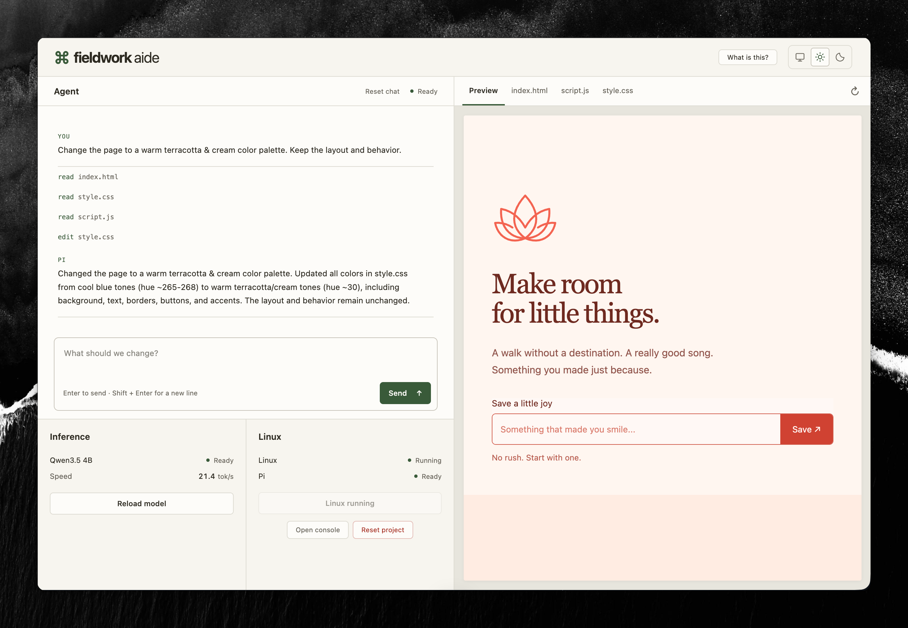
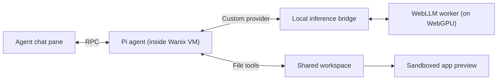

# Fieldwork

Fieldwork is an experimental browser-native local coding agent. It provides a complete agentic coding environment that runs _fully within Chrome_. Yes, you read that right: everything from the agent container to the LLM inference runs within your browser, with no backend services. With Fieldwork, you can ask an agent to update a small website, edit the code alongside the agent, and see a live preview of the results. [Try it here!](https://rhizomatous.github.io/fieldwork/)

<p align="center">
  
</p>

## But why?

To show you, reader, that agentic workflows require shockingly less firepower than you'd think. Or perhaps that browsers provide more firepower than you'd think.

## How it works

The Fieldwork agent is a Pi harness running inside an emulated Linux VM. The language model is Qwen3.5 4B (4-bit), running on your
GPU through WebGPU. Model weights are downloaded and cached locally on first use. Files are stored in your browser using Origin Private File System (OPFS). Codemirror is used for the editor panes. For more on these building blocks, see:

- [Wanix](https://wanix.dev/)
- [Pi](https://pi.dev/)
- [WebLLM](https://webllm.mlc.ai/)
- [WebGPU](https://developer.mozilla.org/en-US/docs/Web/API/WebGPU_API)
- [OPFS](https://developer.mozilla.org/en-US/docs/Web/API/File_System_API/Origin_private_file_system)
- [Codemirror](https://codemirror.net/)

## Architecture



## Develop locally

You'll need:

- Nix
- Docker (or equivalent with `linux/386` support), only to build the Linux image.
- A desktop Chromium browser with WebGPU and hardware acceleration enabled, plus enough GPU memory for a 4B model.

Enter the dev environment with `nix develop` or load it automagically with direnv.

### Launch a dev server

```sh
npm ci
npm run assets
npm run guest
npm run dev -- --port 5199 --strictPort
```

Open [localhost:5199](http://127.0.0.1:5199), then click **Start Linux** and **Load model**. You're now ready to hack on the app!

### Tests

```sh
npm run check      # Formatting, lint, unused code, types, tests, and build
npm run test:guest # Docker integration test with fixture model responses
```

### Build for production

After preparing the assets and Linux image above:

```sh
npm run build
```

Serve `dist/` statically over HTTPS.
