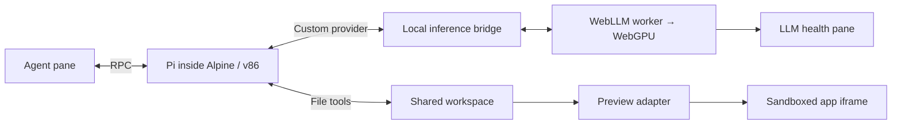

# Fieldwork

A browser-local coding-agent experiment. Pi runs in an emulated Alpine Linux guest, asks a WebGPU model for its next action through a shared-filesystem bridge, and edits a vanilla website shown in a sandboxed preview.

## Run locally

Requires Node 22+, npm, and Docker with `linux/386` support to build the guest. Docker is **not** needed when using the finished website. Use a desktop Chromium browser with WebGPU and hardware acceleration.

```sh
npm ci
npm run assets
npm run guest
npm run dev -- --port 5199 --strictPort
```

Open <http://127.0.0.1:5199>. Click **Start Linux** and **Load model**, then submit a small change when both are ready. The only model is Qwen3 4B (4-bit); its weights download on first use and are cached locally. Linux and Pi startup under emulation can take a minute or longer depending on hardware; the boot console exposes the actual Linux shell and diagnostics.

A useful first prompt for the small default model:

> Use the read tool to inspect index.html. Then use the edit tool to change the main heading to "Small ideas, made real." Only finish after the edit tool reports success.

The workspace lives in browser OPFS when available. Clearing site data removes it. **Reset** restores the three starter files and starts a fresh Pi session. **Export** downloads a self-contained HTML snapshot. Runtime and guest assets are generated locally and ignored by Git.

```sh
npm test
npm run test:guest # Docker transport/tool/cancellation test, fixture inference
npm run build
npm run preview -- --port 5199 --strictPort
```

The `dist/` output can be served statically over HTTPS. The development server is only an asset server, never an inference or agent backend. Vite sends COOP/COEP headers; configure equivalent headers when hosting elsewhere. Hot reload is disabled deliberately: explicitly reload after code changes so a file save does not destroy a running VM or model.

## Architecture



## React shell

Fieldwork uses React with Vite. `index.html` is the entry point; `src/App.jsx` composes the chat, inference, Linux, preview, and console panels in `src/components/`. The generated workspace app remains vanilla HTML/CSS/JavaScript.

`src/fieldwork.js` creates one session per page. `src/session.js` owns runtime events, inference requests, commands, and an immutable state snapshot. React subscribes with `useSyncExternalStore`; components never construct the VM or worker. React Strict Mode is enabled. The console stays mounted when hidden, and the iframe document changes only when workspace files change or the user refreshes it, preserving app state during metrics and conversation updates.

## Execution boundaries

- `guest/supervisor.mjs` runs **inside Linux**, embeds the real Pi `Agent` core with Pi's built-in read/write/edit/bash tools, receives UI commands, and writes agent events to `/bridge`. The full Pi CLI remains a research target; the working build uses its smaller SDK path.
- `guest/provider.mjs` is a real Pi custom provider. It writes the model context to `/bridge/request.json` and consumes the corresponding response. Pi validates and executes its normal tools and continues the loop inside Linux.
- `src/runtime.js` boots Wanix, mounts the persistent project, and transports files and events. No shell tools execute on the host machine.
- `src/inference.worker.js` owns the WebLLM engine and GPU inference. Structured JSON selects one Pi tool or a final response. It does not execute tools.
- `src/protocol.js` translates message formats and assembles the preview from actual workspace files.
- The preview iframe runs with `allow-scripts` and without `allow-same-origin`. Its CSP blocks network requests. The initial project supports `index.html`, `style.css`, and `script.js`, not arbitrary assets, npm dependencies, or ES module graphs.

No guest network device is configured. Model downloads are the main external requests after loading the static app. Full offline reload support is not implemented: caching weights alone does not cache every application asset.

## Versions and implementation choices

- Wanix and extras: `0.4.0-rc2`. The npm default tags differ; pin the explicit version.
- Wanix's standard Go WASM build is used. The smaller TinyGo build exhausted its heap while unpacking the Pi filesystem in testing.
- Alpine: 3.22, x86; Node 22; Pi: `@mariozechner/pi-coding-agent@0.73.1`. This established release has a tested provider/RPC interface; upstream has since renamed its packages. The guest dependency graph is locked in `guest/package-lock.json`.
- WebLLM: `0.2.85`. Model: Qwen3 4B, 4-bit, 4,096-token context. Earlier validation notes below refer to the original 1.5B prototype.
- Guest memory: 512 MiB, plus Wanix, the root filesystem, model allocations, and browser overhead.
- Current generated rootfs: approximately 36 MiB compressed. This is a working baseline, not a minimal image.

## Current limitations

- Cold boot is still emulated and takes time. The first full-CLI image was 58 MiB and loaded too slowly through 9P. The current build bundles Pi core and its coding tools into a 3.9 MiB JavaScript file, reducing the compressed guest to 36 MiB. Further trimming is possible.
- Model output streams into diagnostics/metrics, but tool actions are buffered until a complete valid JSON object is available. Pi's final text is delivered after generation.
- Each user turn is limited to ten model calls. The provider times out after four minutes per call. Small models can still produce poor edits or fail to follow a task.
- Context is deliberately small. Oversized requests surface engine errors; there is no custom transcript compression layer. Reset starts fresh.
- Stopping aborts the agent and model but does not undo completed writes. The three-file preview refreshes after tool completion; multi-file changes are not transactional.
- Refresh, reset, and export operate on the three supported files. Additional file types and external dependencies are outside this first version.
- The pinned older Pi dependency tree reported eight high-severity npm findings at build time. The guest has no network device; the app dependency audit was clean. Review/upgrade the agent dependency tree before public distribution.

## Validation

- Production frontend build and nine protocol/preview/session tests pass, including subscription lifecycles, inference routing, cancellation, and worker failure recovery.
- Pi version and RPC startup verified in a network-disabled 32-bit Docker container.
- Deterministic bridge smoke test: Pi executed its real `edit` tool, changed an HTML title, received the tool result, and completed its turn. The inference response in this isolated test was a fixture, not a model-quality test.
- React migration browser check: model load, Linux boot, OPFS restoration, console toggling, and a real read/edit turn passed. The preview counter survived unrelated UI updates; the final edit appeared as revision 2. No browser errors or warnings were observed.
- Real browser end-to-end test: Qwen2.5-Coder 1.5B running on WebGPU selected Pi's `read` and `edit` tools inside v86. The heading changed to “A little more wonder.” in the live preview. After a page reload and Linux restart, the edited heading was restored from OPFS.
- Observed GPU decode speed was approximately 43–47 tokens/second on this machine; this is a single-session observation, not a benchmark.
- Short prompts can still elicit a false claim of an edit, even after reading the file. Each turn requires an initial inspection; the UI reports when no app files changed. Explicit tool-directed prompts worked in the browser test. Broader coding-task reliability and larger model options remain unvalidated.
- The deterministic guest test also verified tool continuation and cancellation. Unit tests cover malformed actions, transcript translation, and preview escaping. These tests do not measure model quality.

## Attribution

Built on [Wanix](https://github.com/tractordev/wanix), [v86](https://github.com/copy/v86), [Pi](https://github.com/badlogic/pi-mono), and [MLC WebLLM](https://github.com/mlc-ai/web-llm). The [Codex in Wanix](https://github.com/loopwork/wanix-codex) project informed the shared-filesystem architecture and Go runtime choice. Third-party packages and Linux components retain their respective licenses.

### Conversation reset

**Reset chat** clears the displayed conversation and resets Pi’s context after the guest acknowledges the command. It keeps app files and the loaded model. Reset is disabled while the agent is working; stop the current turn first. Rebuild the guest with `npm run guest` after updating from a version without reset acknowledgements.
